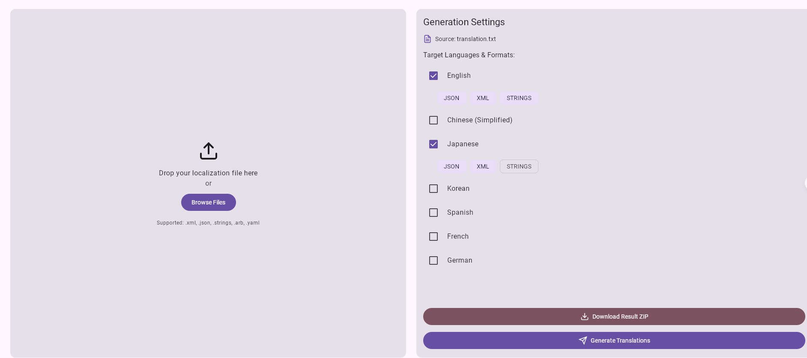

# Multilingual Generation System (Vibe Coding & Gemini CIL to build)

An intelligent, full-stack localization tool built with **Kotlin Multiplatform (KMP)** and powered by local AI. This system automates the translation of localization files (JSON, XML, etc.) into multiple languages and formats, ensuring privacy and efficiency.



## 🚀 Key Features

*   **Full-Stack Kotlin**: Shared business logic across Backend (Ktor) and Frontend (Compose for Web).
*   **Local AI Power**: Integrates with **Gemma 3** (via MLX) for high-quality, privacy-first translations running entirely on your machine.
*   **Batch Processing**: Generate translations for multiple target languages and file formats in a single request.
*   **Multi-Format Support**:
    *   Input: `.json`, `.xml`, `.strings`, `.properties`, `.txt`
    *   Output: `.json`, `.xml`, `.strings`, `.properties`
*   **Translation Memory**: Database-backed caching (PostgreSQL) to reuse translations and reduce AI inference time.
*   **Modern Web UI**: A polished, reactive dashboard built with Compose Multiplatform (Wasm/JS).

## 🛠️ Technology Stack

*   **Language**: Kotlin (Multiplatform)
*   **Frontend**: Compose Multiplatform (Web Target - Wasm/JS)
*   **Backend**: Ktor Server (JVM)
*   **Database**: PostgreSQL (via Exposed & HikariCP)
*   **Caching**: Redis
*   **AI Engine**: Local MLX Server (running Gemma 3)
*   **Infrastructure**: Docker Compose

## 📋 Prerequisites

*   **JDK 17+**
*   **Docker Desktop** (or Colima)
*   **Python 3.10+** (for MLX Server)
*   **Apple Silicon Mac** (Recommended for MLX performance)

## 🏃‍♂️ Getting Started

### 1. Start the Local AI Model
This system relies on a local LLM API. Start the `mlx_lm.server` on port **5002**:

```bash
# Install MLX LM
pip install mlx-lm

# Run the server (replace with your model path)
mlx_lm.server --model mlx-community/gemma-3-12b-it-4bit --port 5002
```

### 2. Start Infrastructure
Launch the database and cache services:

```bash
cd MultilingualGenerationSystem
docker-compose up -d
```

### 3. Run the Backend Server
Start the Ktor application:

```bash
./gradlew :server:run
```
*The server will start at `http://0.0.0.0:8080`.*

### 4. Run the Web Application
Launch the frontend dashboard:

```bash
./gradlew :composeApp:jsBrowserRun
```
*The browser will open automatically.*

## 💡 How to Use

1.  **Upload**: Drag & drop your source localization file (e.g., `strings.xml` or `en.json`) into the upload zone.
2.  **Configure**:
    *   Select your target languages (e.g., Chinese, Spanish, French).
    *   Choose the desired output format for each language.
3.  **Generate**: Click the **🚀 Generate Translations** button. The system will process the file using the local AI model.
4.  **Download**: Once complete, click **⬇ Download Result ZIP** to get a package containing all your translated files, organized by language.

## 🏗️ Architecture

The project follows a clean **Kotlin Multiplatform** architecture:

*   **`shared`**: Contains common data models (`TranslationKey`, `GenerateRequest`), business logic, and file parsers/generators. Shared between Client and Server.
*   **`server`**: Ktor application handling API requests, database interactions (Translation Memory), and orchestration of the AI translation service.
*   **`composeApp`**: The web frontend implementing the UI logic and state management.

---
*Built with ❤️ using Kotlin Multiplatform and Local AI.*
